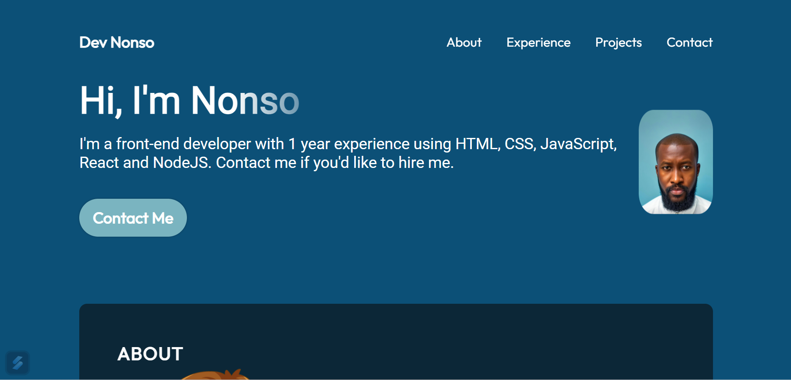
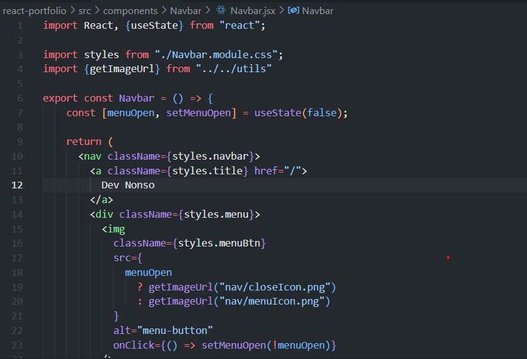
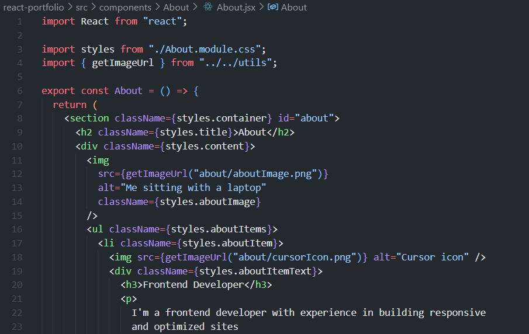

# My Portfolio Website

This is a personal portfolio website built using React to showcase my skills, projects, and achievements.

## Table of Contents

- [Demo](#demo)
- [Features](#features)
- [Installation](#installation)
- [Usage](#usage)
- [Technologies Used](#technologies-used)
- [Project Structure](#project-structure)
- [Sample Codes](#sample-codes)


## Demo

Screenshot of deployed portfolio website.


## Features

- **Responsive Design**: The website is designed to be accessible and user-friendly on various devices.
- **Projects Showcase**: Display a collection of my notable projects with details.
- **Contact Information**: Provide ways for visitors to reach out to you.

## Installation

1. Clone the repository:

   ```bash
   git clone https://github.com/your-username/portfolio.git

2. Change into the project directory:

    ```bash
    cd react-porfolio

3. Install dependencies:

    ```bash
    npm install

## Usage

1. Run the development server:

    ```bash
    npm start

## Technologies Used

- **HTML**
- **CSS**
- **React**
- **JavaScript**

## Project Structure

    ```
    src/
    |-- assets /
    |-- public /
    |-- src /
    |-- components/
    |   |-- About
    |   |-- Contact
    |   |-- Experience
    |   |-- Hero
    |   |-- Navbar
    |   |-- Projects
    |   |-- ...
    |-- data /
    |   |-- history.json
    |   |-- projects.json
    |   |-- skills.json
    |-- App.jsx
    |-- App.module.css
    |-- index.css
    |-- main.jsx
    |-- Utils.js
    |-- vars.css

## Sample Codes




## Deployed Website
https://659c5890249fad1dec35b4e9--beamish-khapse-46b254.netlify.app/